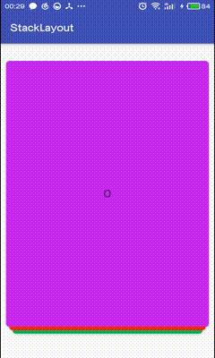
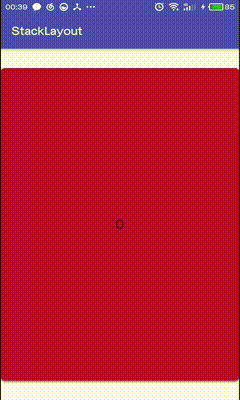

# 摘要
第一次看见堆叠卡片的效果是在“探探app”上，网上也有很多实现。前段时间由于工作需要，我也实现了一个。趁此总结一下自己的心路历程，也希望对控件感兴趣的童鞋有所帮助。

# 效果图

# 功能
- 自定义卡片的堆叠效果
- 自定义卡片移除动画
- 支持加载更多

# 实现步骤
## Adapter: 提供View
盗用了RecyclerView的方式，于是我们可以这么使用：`mStackLayout.setAdapter(...);`
```java
public class StackLayout extends FrameLayout {
    private Adapter mAdapter;
    public void setAdapter(Adapter adapter) {
        mAdapter = adapter;
        onSetAdapter(adapter);
    }

    private void onSetAdapter(Adapter adapter) {...}

    public static abstract class Adapter<VH extends ViewHolder>{
        public abstract VH onCreateViewHolder(ViewGroup parent, int position);

        public abstract void onBindViewHolder(VH holder, int position);

        public abstract int getItemCount();

        private VH getViewHolder(ViewGroup parent, int position){
            VH viewHolder = onCreateViewHolder(parent, position);
            onBindViewHolder(viewHolder, position);
            return viewHolder;
        }
    }

    public static abstract class ViewHolder {
        public final View itemView;
        public ViewHolder(View itemView) {
            this.itemView = itemView;
        }
    }
}
```
<br/>

## DataSetObserver: 观察者，刷新View
同样盗用了RecyclerView的方式，于是我们可以这么使用：`mAdapter.notifyDataSetChanged();`
```java
public class StackLayout extends FrameLayout {
    private void onSetAdapter(Adapter adapter) {
        adapter.registerDataSetObserver(mItemObserver);
        mItemObserver.dataChanged(adapter);
    }
    
    ItemObserver mItemObserver = new ItemObserver();
    private class ItemObserver extends DataSetObserver {
        @Override public void onChanged() { dataChanged(mAdapter); }

        @Override public void onInvalidated() { dataChanged(mAdapter); }

        private void dataChanged(Adapter adapter) {
            // 移除先前的 view, 并从 adapter 里拿到新的 view。
            StackLayout.this.removeAllViews();
            for(int i=getCurrentItem(); i<adapter.getItemCount(); i ++) {
                ViewHolder viewHolder = adapter.getViewHolder(StackLayout.this, i);
                StackLayout.this.addView(viewHolder.itemView, 0);
            }
        }
    }
    
    public static abstract class Adapter<VH extends ViewHolder>{
        ...
        private final DataSetObservable mObservable = new DataSetObservable();

        public void notifyDataSetChanged() {
            mObservable.notifyChanged();
        }

        public void registerDataSetObserver(DataSetObserver observer) {
            mObservable.registerObserver(observer);
        }

        public void unregisterDataSetObserver(DataSetObserver observer) {
            mObservable.unregisterObserver(observer);
        }
    }
}
```
到此为止，我们拥有一个可以刷新数据的FrameLayout，且所有的子View重叠在一个位置。如图：

<br/>

## ViewDragHelper: 卡片滑动事件
ViewDragHelper 实乃神器，能实现所有的滑动需求。主要的逻辑在它的Callback里。
```java
public class StackLayout extends FrameLayout {
    private ViewDragHelper mViewDragHelper = ViewDragHelper.create(this, new ViewDragHelper.Callback(){
        private ScrollManager mScrollManager;
        private View mParent = StackLayout.this;

        // 仅捕获 topChild, 即 最顶上的卡片 可拖动
        @Override
        public boolean tryCaptureView(View child, int pointerId) {
            return mViewDragHelper.getViewDragState() == ViewDragHelper.STATE_IDLE  // 空闲状态
                    && ViewHolder.getPosition(child) == getCurrentItem();           // 且是最上面的卡片, 才可捕获
        }
        ...

        // 手指释放的时候回调
        @Override
        public void onViewReleased(final View releasedChild, float xvel, float yvel) {
            final int totalRange = mParent.getWidth();
            final int left = releasedChild.getLeft();
            if(Math.abs(left - 0) < totalRange/2) { // 移动 < 半屏，回到原位
                getScrollManager().smoothScrollTo(releasedChild, 0, 0, new ScrollManager.Callback() {...});

            }else { // 移动 > 半屏，移除卡片
                getScrollManager().smoothScrollTo(releasedChild, totalRange * (left < 0 ? -1 : 1), releasedChild.getTop(), new ScrollManager.Callback() {
                    @Override
                    public void onComplete(View view) {
                        removeView(view);
                        setCurrentItem(getCurrentItem() + 1);
                    }
                });
            }
        }
    });

    @Override
    public boolean onInterceptTouchEvent(MotionEvent event) {
        return getViewDragHelper().shouldInterceptTouchEvent(event); // 转发事件给 ViewDragHelper
    }

    @Override
    public boolean onTouchEvent(MotionEvent event) {
        getViewDragHelper().processTouchEvent(event); // 转发事件给 ViewDragHelper
        return true;
    }
}
```
到此为止，已经实现了60%了。
<br/>

## PageTransformer: 堆叠卡片
堆叠效果，这应该是该控件最难处理的一部分了，当时也是bug不断，调试了好久。实现方式借鉴了`ViewPager.PageTransformer`，外面可以这样调用`mStackLayout.addPageTransformer(...);`
```java
public class StackLayout extends FrameLayout {
    private ViewDragHelper mViewDragHelper = ViewDragHelper.create(this, new ViewDragHelper.Callback(){
        ...
        @Override
        public void onViewPositionChanged(View changedView, int left, int top, int dx, int dy) {
            int totalRange = mParent.getWidth();
            float position = (1.0f * (left - 0))/totalRange;
            transformPage(position, left < 0);  // 在 view 为止变化的时候，回调动画接口
        }
    }

    private List<PageTransformer> mPageTransformerList = new ArrayList<>();

    public void addPageTransformer(PageTransformer... pageTransformerList) {
        mPageTransformerList.addAll(Arrays.asList(pageTransformerList));
    }

    /**
     * 卡片滑动动画接口, 类似 {@link ViewPager.PageTransformer}
     */
    public static abstract class PageTransformer {
        /**
         * 根据 position 做相应的动画, 其中 position:
         *  [-1, -1]                -> 完全移出屏幕, 待remove状态
         *  (-1, 0)                 -> 手指拖动状态
         *  [0, 栈内页面数)           -> 栈中状态
         *  [栈内页面数, 总页面数)     -> 显示不下, 待显示状态
         *
         * @param page          各卡片的根布局, 即 {@link ViewHolder#itemView }
         * @param position      各卡片的位置
         * @param isSwipeLeft   向左滑动
         */
        public abstract void transformPage(View page, float position, boolean isSwipeLeft);
    }

    private void transformPage(float topPagePos, boolean isSwipeLeft) {
        List<PageTransformer> list = new ArrayList<>(mPageTransformerList); // 保护性复制, 防止污染原来的list
        if(list.isEmpty())
            list.add(new StackPageTransformer());   // default PageTransformer

        int itemCount = mAdapter.getItemCount();
        for(int i=0; i<itemCount; i++) {
            View page = getChildAt(i);
            if(page == null)
                return ;
            for (PageTransformer pageTransformer : list) {
                pageTransformer.transformPage(page, -Math.abs(topPagePos) + ViewHolder.getPosition(page) - getCurrentItem(), isSwipeLeft);
            }
        }
    }
}
```
<br/>
正如ViewPager.PageTransformer对于position分了4段(-INF, -1)、[-1, 0]、(0, 1]、(1, INF)。我们也分了相应的几个状态：

| position                  | 状态                      | 
| --------------------------|:--------------------------|
| [-1, -1]                  | 完全移出屏幕, 待remove状态| 
| (-1, 0)                   | 手指拖动状态              | 
| [0, 栈内页面数)           | 栈中状态                  |
| [栈内页面数, 总页面数)    | 显示不下, 待显示状态      |

注意到，PageTransformer是一个接口，通过实现它，我们给出堆叠效果的真正逻辑。通过`view.setTranslationY()`和`view.setScale()`调整卡片的位置和大小，使之堆叠在一起。
> 外面可以这样调用`mStackLayout.addPageTransformer(new StackPageTransformer());`

```java
public final class StackPageTransformer extends StackLayout.PageTransformer {
    private float mMinScale;    // 栈底: 最小页面缩放比
    private float mMaxScale;    // 栈顶: 最大页面缩放比
    private int mStackCount;    // 栈内页面数

    private float mPowBase;     // 基底: 相邻两 page 的大小比例

    public StackPageTransformer(float minScale, float maxScale, int stackCount) {
        mMinScale = minScale;
        mMaxScale = maxScale;
        mStackCount = stackCount;

        if(mMaxScale < mMinScale)
            throw new IllegalArgumentException("The Argument: maxScale must bigger than minScale !");
        mPowBase = (float) Math.pow(mMinScale/mMaxScale, 1.0f/mStackCount);
    }

    public StackPageTransformer() {
        this(0.8f, 0.95f, 5);
    }

    public final void transformPage(View view, float position, boolean isSwipeLeft) {
        View parent = (View) view.getParent();

        int pageWidth = parent.getMeasuredWidth();
        int pageHeight = parent.getMeasuredHeight();

        view.setPivotX(pageWidth/2);
        view.setPivotY(pageHeight);

        float bottomPos = mStackCount-1;

        if (view.isClickable())
            view.setClickable(false);

        if (position == -1) { // [-1]: 完全移出屏幕, 待删除
            view.setVisibility(View.GONE);

        } else if (position < 0) { // (-1,0): 拖动中
            view.setVisibility(View.VISIBLE);

            view.setTranslationX(0);
            view.setScaleX(mMaxScale);
            view.setScaleY(mMaxScale);

        } else if (position <= bottomPos) { // [0, mStackCount-1]: 堆栈中
            int index = (int)position;  // 整数部分
            float minScale = mMaxScale * (float) Math.pow(mPowBase, index+1);
            float maxScale = mMaxScale * (float) Math.pow(mPowBase, index);
            float curScale = mMaxScale * (float) Math.pow(mPowBase, position);

            view.setVisibility(View.VISIBLE);

            // 从上至下, 调整堆叠位置
            view.setTranslationY(- pageHeight * (1-mMaxScale) * (bottomPos-position) / bottomPos);

            // 从上至下, 调整卡片大小
            float scaleFactor = minScale + (maxScale - minScale) * (1 - Math.abs(position - index));
            view.setScaleX(scaleFactor);
            view.setScaleY(scaleFactor);

            // 只有最上面一张可点击
            if(position == 0){
                if(!view.isClickable())
                    view.setClickable(true);
            }

        } else { // (mStackCount-1, +Infinity]: 待显示(堆栈中展示不下)
            view.setVisibility(View.GONE);
        }
    }
}
```
你也可以仿照这个类，实现自定义的堆叠效果。
<br/>

## PageTransformer: 侧滑动画效果
估计你也猜到了，滑动动画还是由它实现的。看一下内置的渐变动画:
```java
public final class AlphaTransformer extends StackLayout.PageTransformer {
    private float mMinAlpha = 0f;
    private float mMaxAlpha = 1f;

    public AlphaTransformer(float minAlpha, float maxAlpha) {
        mMinAlpha = minAlpha;
        mMaxAlpha = maxAlpha;
    }

    public AlphaTransformer() {
        this(0f, 1f);
    }

    @Override
    public void transformPage(View view, float position, boolean isSwipeLeft) {
        if (position > -1 && position <= 0) { // (-1,0]
            view.setVisibility(View.VISIBLE);

            view.setAlpha(mMaxAlpha - (mMaxAlpha-mMinAlpha) * Math.abs(position));
        } else{
            view.setAlpha(mMaxAlpha);
        }
    }
}
```
外面则这么使用：
```java
mStackLayout.addPageTransformer(
        new StackPageTransformer(),     // 堆叠
        new AlphaTransformer(),         // 渐变
        ...
);
```
到此为止，已经实现了90%，再对外提供一个移除状态回调。
<br/>

## OnSwipeListener: 移除状态回调
当卡片被移除触发回调，可以在此时区分左滑和右滑，以及决定是否加载更多。
```java
public class StackLayout extends FrameLayout {
    private ViewDragHelper mViewDragHelper = ViewDragHelper.create(this, new ViewDragHelper.Callback(){
        // 手指释放的时候回调
        @Override
        public void onViewReleased(final View releasedChild, float xvel, float yvel) {
            if(Math.abs(left - 0) < totalRange/2) {
                ...
            }else {
                getScrollManager().smoothScrollTo(releasedChild, totalRange * (left < 0 ? -1 : 1), releasedChild.getTop(), new ScrollManager.Callback() {
                    @Override public void onComplete(View view) {
                        ...
                        mOnSwipeListener.onSwiped(view, ViewHolder.getPosition(view), left < 0, mAdapter.getItemCount() - getCurrentItem());
                    }
                });
            }
        }
    });

    private OnSwipeListener mOnSwipeListener;
    public static abstract class OnSwipeListener{
        /**
         * 已被移除屏幕时回调. 另外, 可以根据 itemLeft, 决定何时加载更多.
         *
         * @param swipedView        被移除屏幕的view
         * @param swipedItemPos     swipedView 对应的 AdapterPos
         * @param isSwipeLeft       往左滑动
         * @param itemLeft          当前剩余的item个数 (栈中的 + 待显示的)
         */
        public abstract void onSwiped(View swipedView, int swipedItemPos, boolean isSwipeLeft, int itemLeft);
    }
}
```
<br/>

## 其他细节
- 在`dataChanged()`中，注意在刷新数据延迟到上一次动画结束之后。
- 在上一次动画完全结束之前，不可滑动下一张卡片。
- 某些时候，`view.getWidth()`可能为0。

总结，Api设计上基本上致敬了`RecyclerView`和`ViewPager`。总的来说，自己也有很大的收获。
<br/>

# 参考
https://github.com/flschweiger/SwipeStack

https://github.com/xiepeijie/SwipeCardView

https://github.com/mcxtzhang/ZLayoutManager

https://github.com/yuqirong/CardSwipeLayout

https://github.com/xmuSistone/android-card-slide-panel
